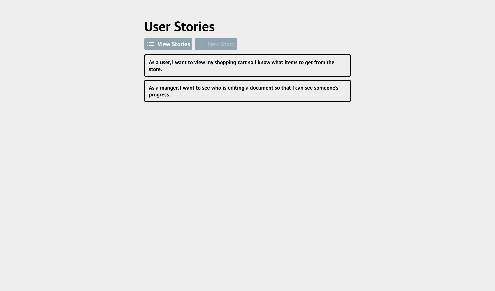
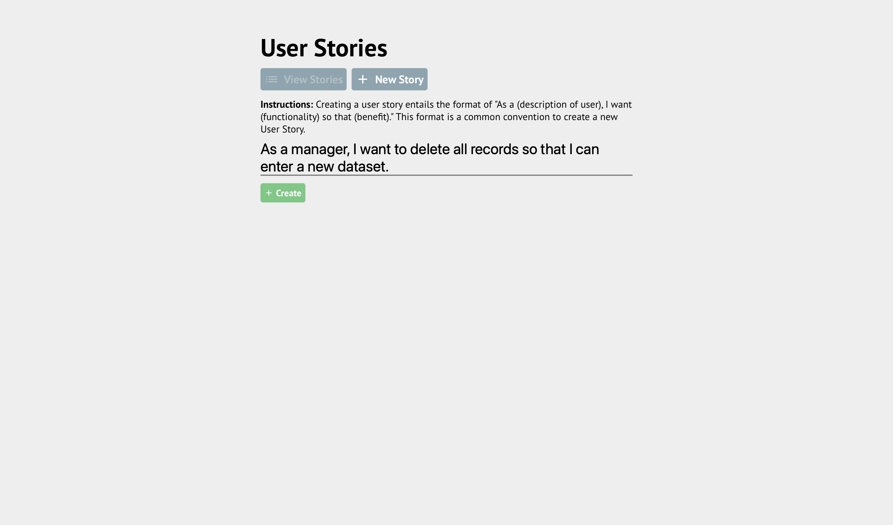
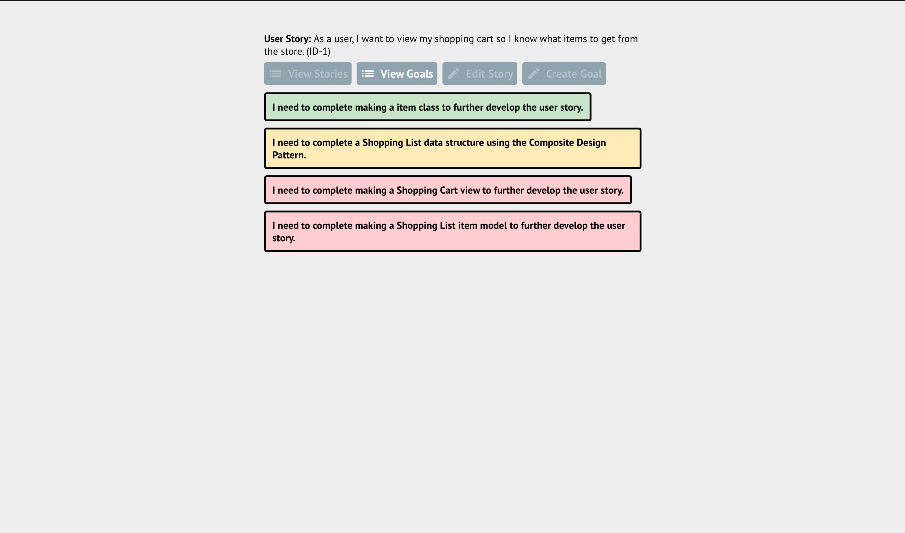
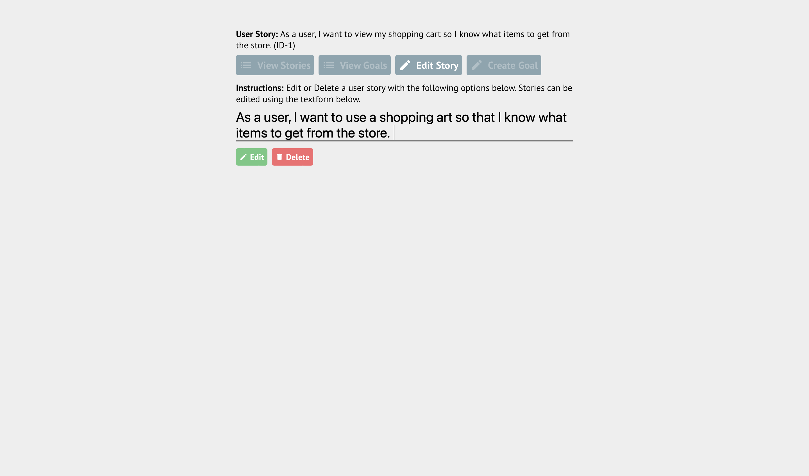
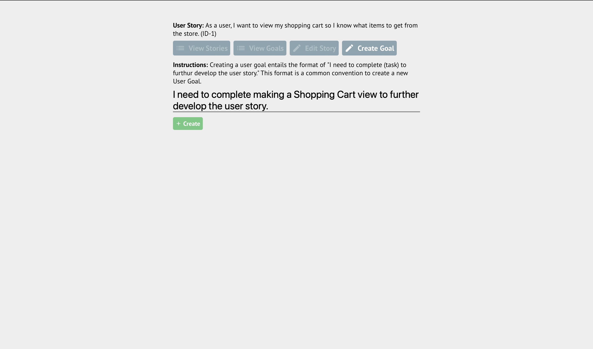
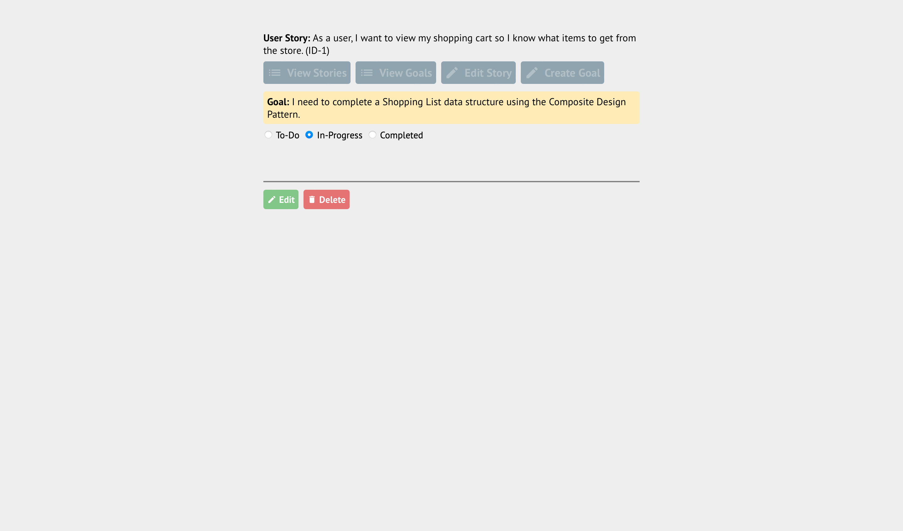

# Stipes

A task management application built using React and Flask. The application features routing to different pages, CRUD methodology, and use of CSS media queries. The purpose of Stipes was to learn React and Flask and develop skills using newer features of JavaScript such as arrow functions and the Fetch API provided by ES6. Using the lessons learned I hope to apply them to future projects and enhance my understanding of these frameworks.

### Application Screenshots

<p align="center">
    
</p>

**Fig. 1:** Showing the homescreen for the application. This is where the user can view their User Stories and see more information about it.

<p align="center">
    
</p>

**Fig. 2:** Showing the new story creation page. Users can create new stories from this page to be displayed within the homescreen.

<p align="center">
    
</p>

**Fig. 3:** Showing goals associated to each user story. This is where the user can view goals associated to a user story and quickly glance at the progress of a goal through the background color of a card. Red signifies a story is in a "to-do" state, yellow signifies a goal is in a "in-progress" state, and green signifies the goal is completed.

<p align="center">
    
</p>

**Fig. 4:** Showing the edit story page. This is where users can edit the selected user story and delete a user story with all goals associated to the selecteed story.

<p align="center">
    
</p>

**Fig. 5:** Showing the create goal page. This is where users can create and add new goals to the selected user story.

<p align="center">
    
</p>

**Fig. 6:** Showing the create goal page. This is where users can change a goal through a variety of ways. Users can change a goal's status by using the radio buttons, edit a goal, and delete a goal.

### Used Tools

Tools used to create the application frontend and backend are listed. The full requirements for the frontend are listed within _package.json_ and can be installed via `npm install`. The full requirements for the frontend are listed within _requirements.txt_ and can be installed via `pip install -r requirements.txt`.

- Frontend
  - React 17.0.2
  - React-Router 6.2.1
- Backend
  - Flask 2.0.2
  - Flask-SQLAlchemy 2.5.1

### Installing Stipes

Installing Stipes requires the following software to be installed on the host system:

- Python 3
- Package Installer for Python (pip)
- Node Package Manager (npm)

## Frontend Design

The Frontend Design of the website is composed of a page heading, navigation, and main section. The application takes advantage of outlets and views provided by the React Router to change the experience depending upon the URL. The application uses external fonts to deliver `material-icons` and `PT Sans` from Google Fonts. The application uses JavaScripts native `fetch()` API to make HTTP calls to the Flask backend to send and receive JSON objects. There is minimal error-handling with only application errors being logged to the console.

### Custom Components

Components created to encapsulate functionality and styles with most being wrappers to already created components.

- **Button**: Button does is a `<button>` element with added functionality being a rendered icon if provided to the element. The Button component has the following props `[className, onClick, icon, childern]`.
- **Card**: Card is a `<Link>` that provides a consistent styling to elements used to show user stories and goals. The Card component has the following props `[className, childern]`.
- **SectionNavLink**: SectionNavLink is a `<NavLink>` element providing consistent styling with navigation link elements with added functionality such as custom styling for a active URL. SectionNavLink passes props given to the element down to the `<NavLink>` element that ensures default functionality is not removed. The SectionNavLink component has the following props `[to, state, className, icon, childern]`.
- **Toast**: Toast is a element to deliver messages to the user if enabled through a true/false predicate. Toast element is added to a page where a toast message should appear and appends itself a block element. The Toast component has the following props `[display, childern]`.

### Application Styling

The application uses CSS to ensure consistent styling with universal styling being stored within `index.css` and custom created stylings being located within a component and page `.module.css` file. Ensuring components that use their own stylings but still retain a common theme can use CSS variables defined within `index.css`. Stylings named `*_utility` classes are used along side CSS variables to ensure a consistent experience within the application.

### Frontend Routing

The application's frontend routing uses React Router to create two differnt page with outlets being used to switch nested views in each page. The routing scheme is located within `index.js` and features use of URL parameters and an index route. The URL parameters are **story_id** and **goal_id** and used to identify goals assoicated to user stories and select user stories themselves. The index route is used to display a default view by the parent route which is displayed by the default view for `/` route being the `<App />` component. This page is used to display all user stories. The index route is also included to the second page with `/:story_id` route being the `<ViewGoals />` component. This page is sued to display all the goals associated to the selected user story in the url parameter.

```
|----/
|    |----create
|    |----(story_id)/
|    |    |----edit
|    |    |----create
|    |    |----(goal_id)
```

## Backend Design

### Database Models

### Backend Routing

The application's backend consists of ten points. The routing scheme contains two variables used to identify a specifc goal (with **goal_id**) and a specific story (with **story_id**). All goals have a child to parent relationship with a story.

```
|----/api/
|    |----(story_id)/
|    |    |----goals/
|    |    |    |----(goal_id)/
|    |    |    |    |----edit/status
|    |    |    |    |----edit/content
|    |    |    |    |----delete
|    |    |    |----create
|    |    |----delete
|    |    |----edit
|    |----create
```

#### Route Descriptions

- `[GET] /api/` is used for getting a JSON list of all story records containing a story's `content` and `id`.
  - `[GET] /api/(story_id)` is used for getting a JSON object of the selected story (using `story_id` url parameter) record containing its `content` attribute.
    - `[GET] /api/(story_id)/goals` is used for getting a JSON list of all goal records tied to a story record containing each goal's `content` and `id`.
      - `[GET] /api/(story_id)/goals/(goal_id)/` is used for getting a JSON object of a goal record containing a goal's `content` and `id`.
        - `[DELETE] /api/(story_id)/goals/(goal_id)/delete` is used for deleting the selected goal (using `goal_id` url parameter) record from a selected story record (using `story_id` url parameter).
        - `/api/(story_id)/goals/(goal_id)/edit` is used to semantically designate routes to a goal's `status` and `content` attribute.
          - `[PATCH] /api/(story_id)/goals/(goal_id)/edit/status` is used for patching a selected goal (using `goal_id` url parameter) record by editing its `status` attribute.
          - `[PATCH] /api/(story_id)/goals/(goal_id)/edit/content` is used for patching a selected goal (using `goal_id` url parameter) record by editing its `content` attribute.
    - `[DELETE] /api/(story_id)/delete` is used for deleting the selected story (using the `story_id url parameter`) record.
    - `[PATCH] /api/(story_id)/edit` is used for patching a story record by editing its `content` attribute.
    - `[POST] /api/(story_id)/create` is used for posting a new goal record to the selected story (using `story_id` url parameter).
  - `[POST] /api/create` is used for posting a new story record.
